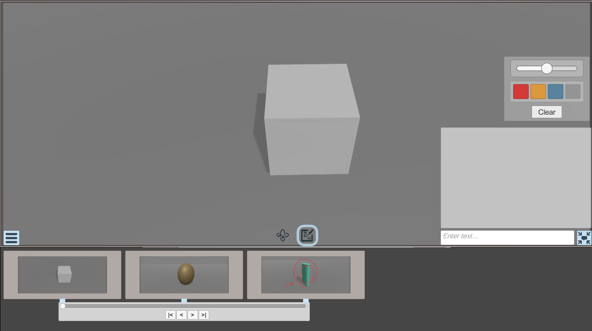
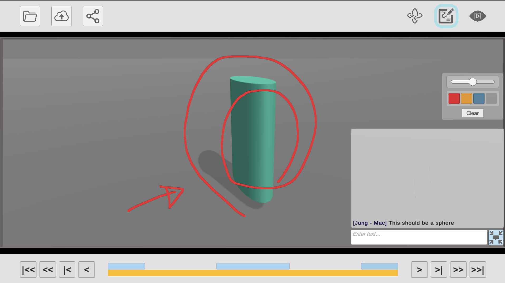
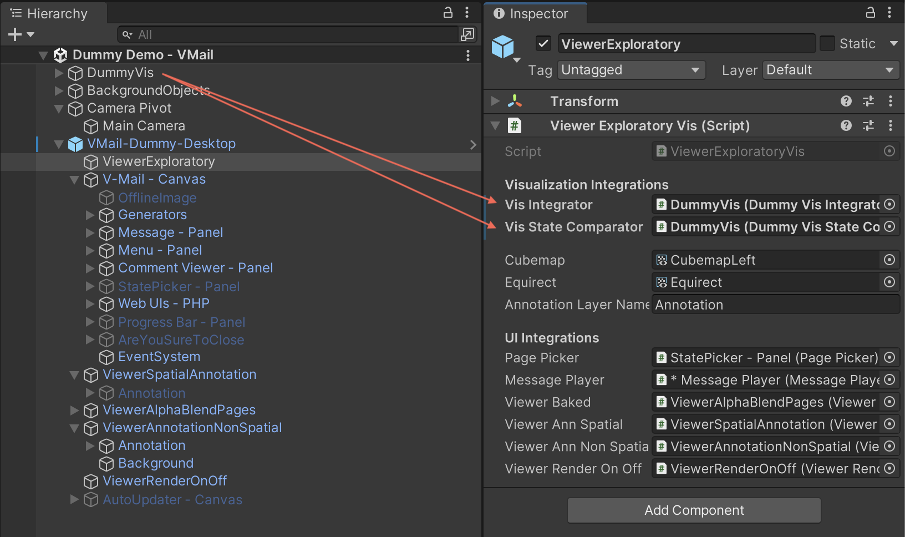
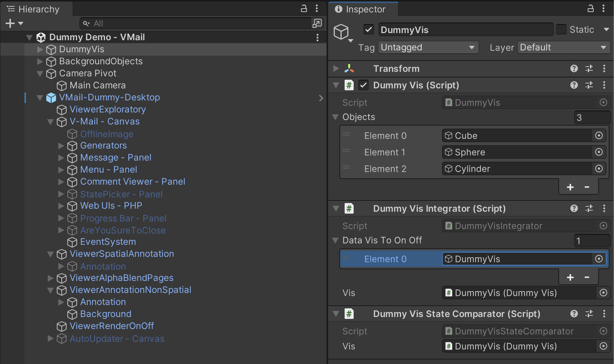
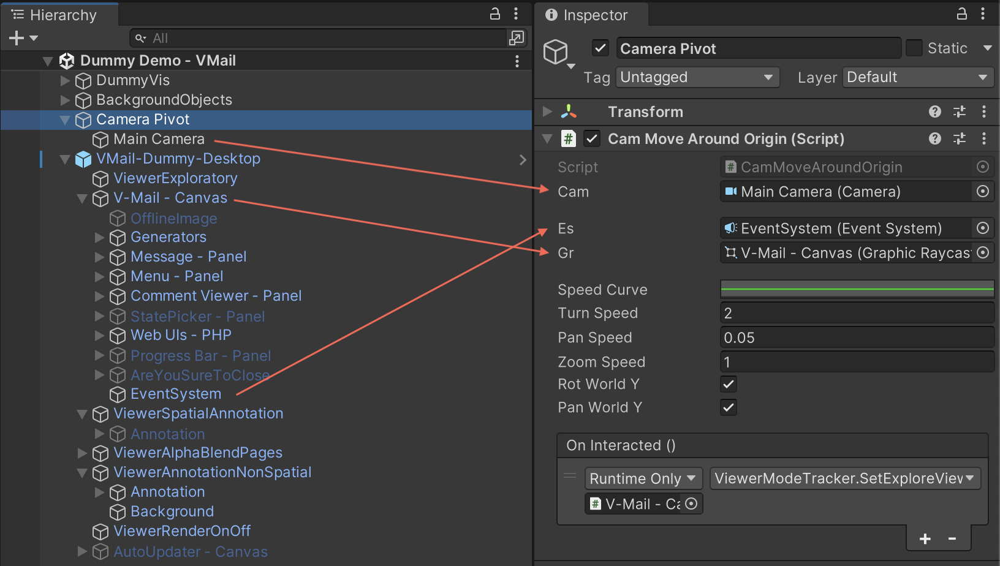
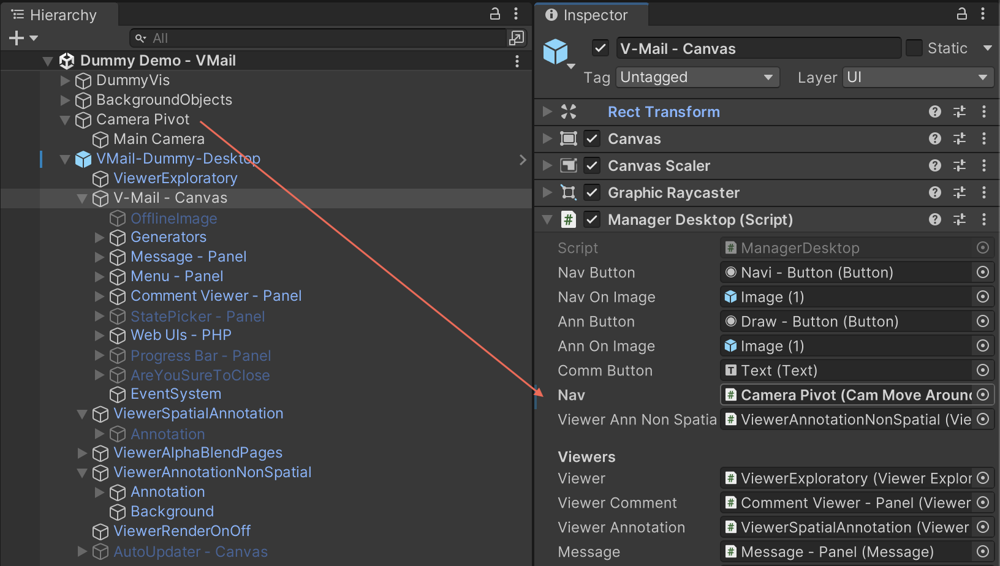

# Visualization Mail (V-Mail)
V-Mail is  a framework of cross-platform applications, interactive techniques, and communication protocols for improved multi-person correspondence about spatial 3D datasets. Please check our paper: <em>V-Mail: 3D-Enabled Correspondence about Spatial Data on (Almost) All Your Devices  (https://doi.org/10.1109/TVCG.2022.3229017).</em>

## Related GitHub Repos
* PC/Mac, Android V-Mail Clients
    * https://github.com/JungWhoNam/VisualizationMail
* V-Mail Server
    * https://github.com/JungWhoNam/VisualizationMailServer
* Integration to a data visualization application
    * https://github.com/JungWhoNam/BrainTensorVis/tree/vmail

# PC/Mac, Android V-Mail Clients

    <table>
	    <tr>
    	    <td style="padding:4px">
        	    
      	    </td>
            <td style="padding:4px">
            	
            </td>
        </tr>
    </table>

This Unity project provides implemention of two V-Mail clients.
* PC/Mac client integrated into a simple demo scene (left)
    - `VMail/Demos/Dummy/Dummy Demo - VMail.unity`
    - Use left-mouse to rotate, mouse-wheel to zoom, mouse-wheel click to pan.
    - Press 'r' to change the object's color and scale.
    - Press down or up arrow key to change the geometry, e.g., cube, sphere, cylinder.
* Android client (right)
    - `VMail/_Scenes/VMail Mobile.unity`

# Integrating V-Mail into another Unity project
## Import V-Mail
> Check out the latest relase: https://github.com/JungWhoNam/VisualizationMail/releases

Import `VisualizationMail_v*_*_*.unitypackage` into your project. These directories should be in your project: `VMail`, `StreamingAssets/VMail, StreamingAssets/ffmpeg`, and `Plugins/Android`.

## Configure Unity project
### Add `TextMeshPro`
* When you load V-Mail, a panel will appear with a button to install TextMeshPro. 
* Do `Windows/TextMeshPro/Import TMP Essential Resources` if not.

### Set Resolutions
* The mobile application is designed for S10 (2280x1080).
* The desktop application is designed for (1920x1080).

### Add `Annotation` layer
* Set User Layer 27 to `Annotation`. See [this link](https://docs.unity3d.com/Manual/class-TagManager.html) to see how to add a layer.
* Also make sure `DrawingLayer` property in `DrawingSettings` is set to the Annotation layer (search `ViewerSpatialAnnotation` GameObject in the scene).

## Implement interfaces and abstract classes
> See our example scripts under `VMail/Demos/Dummy/` and use `VMail/Demos/Dummy/VMail-Dummy-Desktop` prefab as a start.

    <table>
	    <tr>
    	    <td style="padding:4px">
        	    
      	    </td>
            <td style="padding:4px">
            	
            </td>
        </tr>
    </table>

* Implement `VisIntegrator` and `VisStateComparator` and assigns these into `ViewerExploratoryVis` (left). 
* Assign GameObject(s) that contain your data visualization to `dataVisToOnOff` in your implementation of `VisIntegrator` (right). These objects will be turned off in the story mode. Also, these will be off when opening a menu panel for uploading or downloading a V-Mail.

## Configure Main Camera
* Set Camera's `Viewport Rect 'Y'` to `0.2593` and `Viewport Rect 'H'` to `0.7407`.
* Set HDR property of Camera to `Use Graphics Settings` (instead of `Off`);

## Integrate the camera navigation

    <table>
	    <tr>
    	    <td style="padding:4px">
        	    
      	    </td>
            <td style="padding:4px">
            	
            </td>
        </tr>
    </table>

* Attach `VMail/_Scripts/Utils/CamMoveAroundOrigin.cs` to a GameObject and configure the parameters. Make sure to add an event to `OnInteracted()` and set `ViewerModeTracker.SetExploreView` (left). 
* Link the GameObject with `CamMoveAroundOrigin` as `Nav` in `ManagerDesktop` (right).

# Changing the V-Mail Server
Change values of these variables to link your own server.
* Change `CodeDirURL` in `VMail/_Scripts/Servers_php/WebIntegration.cs`, e.g., "https://jungwhonam.com/VMails_Codes/".
* Change `ServerDir` in `VMail/_Scripts/VMailWebManager.cs`, e.g., "https://jungwhonam.com/VMails_Codes/data/".
* Change `rootDirNameServer` in `VMail/_Scripts/VMailWebManager.cs`, e.g., "data".

# Deep Linking
* See https://docs.unity3d.com/Manual/deep-linking.html for setting deep linking features for different platforms.
* See `VMail/_Scripts/Utils/DeepLinkIntegration.cs` for processing a deep URL.

# Known Issues
‘ffmpeg’ can't be opened because it's from an unidentified developer.
* This error might appear when playing the demo scene in the Editor and uploading changes. This can be solved by running `Assets/StreamingAssets/ffmpeg/Mac/ffmpeg` in Terminal once. This should be not be a problem in build. 

Deep linking does not work in a Windows build.
* Currently, Unity does not support deep linking in Windows builds but supports UWP. However, Pipe does not work in UWP, which is needed for calling `ffmpeg` executable.